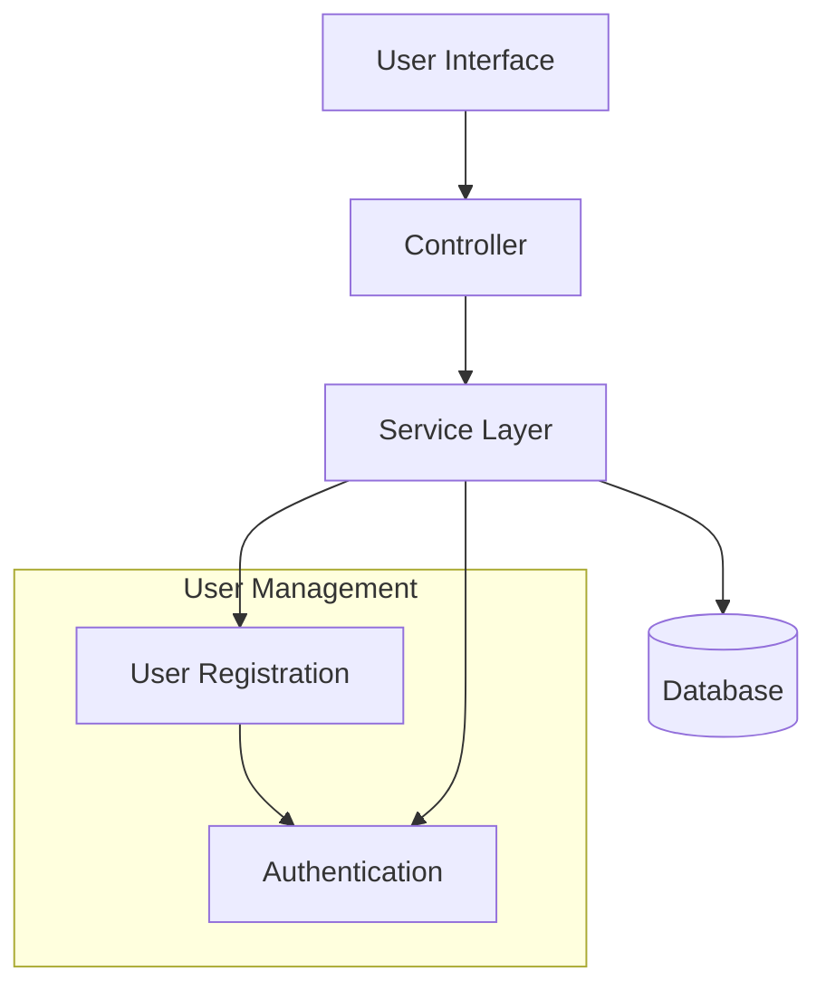
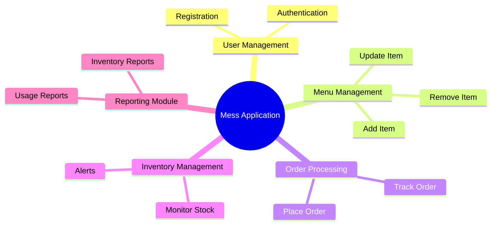

# Mess Application 🍽️

The Mess Application is a comprehensive Java-based system designed to streamline the management of mess operations, including food ordering, inventory tracking, and user management. It integrates various functionalities to enhance the user experience for both customers and administrators, ensuring efficient meal service and resource allocation. The application is notable for its modular architecture and user-friendly interface, making it suitable for both small and large-scale mess operations.

---

## ✨ Key Features
- User registration and authentication for secure access to the application.- Food menu management allowing mess administrators to add, update, or remove items.- Order management system for users to place and track their meal orders.- Inventory tracking to monitor stock levels and alert administrators when supplies are low.- Reporting tools to analyze usage patterns and optimize resource allocation.
---

## 🛠️ Tech Stack & Tools

| Category | Technologies |
|----------|-------------|
| **Backend** | Java, Spring Boot |
| **Frontend** | Angular, HTML, CSS |
| **Database** | MySQL |
| **DevOps & Tools** | Maven, Git |
| **Build & Dependencies** | Spring Framework |

---

## 🏗️ Architecture

The architecture of the Mess Application follows a layered approach, separating concerns into distinct layers: the presentation layer handles user interactions, the service layer contains business logic, and the data access layer manages database interactions. This modular design enhances maintainability and scalability, allowing for easy updates and feature additions. Components communicate through well-defined interfaces, ensuring loose coupling and high cohesion.



---

## 📦 Component Descriptions

| Component | Description |
|-----------|-------------|
| **User Management** | Handles user registration, authentication, and profile management. |
| **Menu Management** | Allows administrators to manage food items and their availability. |
| **Order Processing** | Facilitates the ordering process for users and tracks order status. |
| **Inventory Management** | Monitors stock levels and alerts when supplies need replenishment. |
| **Reporting Module** | Generates reports on usage patterns and inventory status. |

---

## 📂 Project Structure

```
MessApplication/
├── src/
│   ├── main/
│   │   ├── java/
│   │   │   └── com/
│   │   │       └── messapp/
│   │   │           ├── controller/
│   │   │           ├── model/
│   │   │           ├── service/
│   │   │           └── repository/
│   │   └── resources/
│   │       └── templates/
│   └── test/
└── pom.xml
```

---

## 🚀 Setup & Installation
1. **Clone the repository:**
```bash
git clone https://github.com/abh1shekChoudhary/MessApplication.git
cd MessApplication
```
2. **Install dependencies:**
```bash
mvn install
```
3. **Configure environment variables:**
Create a `.env` file with the required variables such as database connection details.4. **Run the application:**
```bash
mvn spring-boot:run
```
---

## 💡 Usage Examples

To use the Mess Application, start by registering a new account through the user interface. Once registered, you can log in and view the available food menu. Select items to order and proceed to checkout. Administrators can manage the menu and track orders through the admin dashboard.

---

## 🔧 Configuration

Ensure that your database is set up correctly and that the connection details are specified in the `.env` file. The application uses Spring Boot profiles to manage different environments (development, testing, production).

---

## 🧠 Design Patterns

The application employs the MVC (Model-View-Controller) design pattern to separate business logic from user interface concerns, enhancing maintainability and scalability.

---

## 🧠 Project Mind Map



---


---

<p align="center">
  Made  by <a href="https://github.com/abh1shekChoudhary">Abhishek Choudhary</a>
</p>
